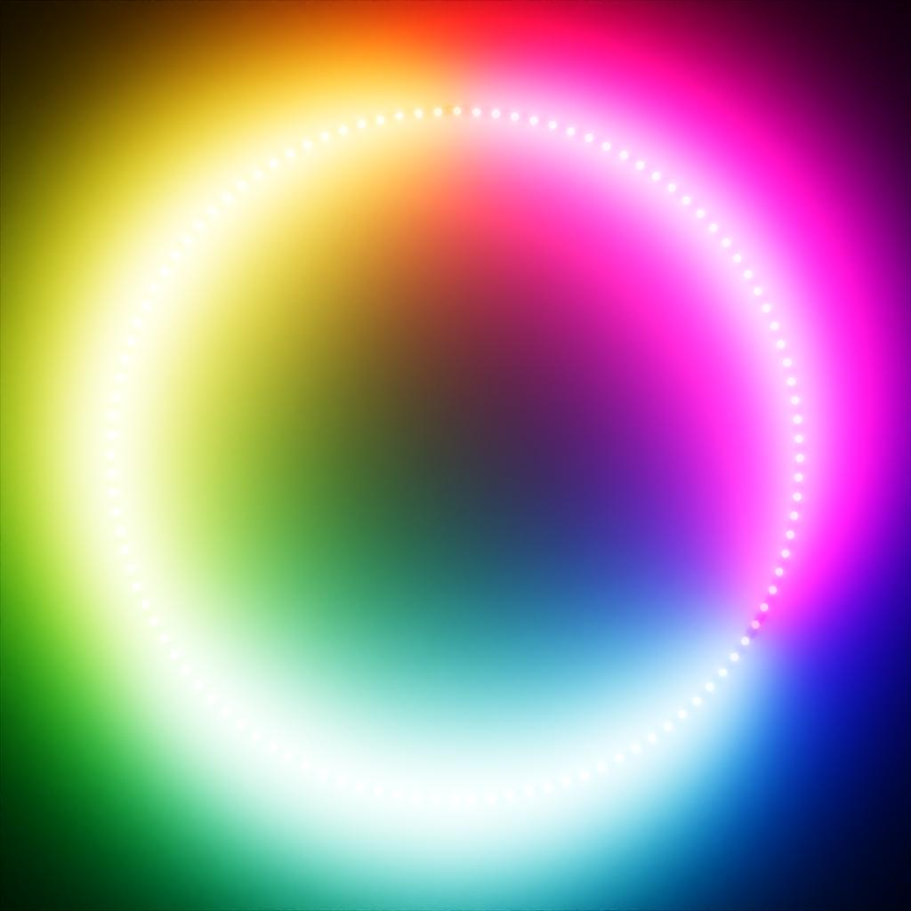

<header style="width: 100%; text-align: center; align-content: center; align-self: center; margin-bottom: 75px; color: #fff; text-decoration: none;">
        <nav>
            <a style="color: #fff; text-decoration: none; margin-right: 20px;" href="https://thecodecofficial.github.io/Blog/">Home</a>
            <a style="color: #fff; text-decoration: none; margin-right: 20px;" href="https://thecodecofficial.github.io/Blog/about.html">About</a>
        </nav>
    </header>
<div style="text-align:center"><h1>Reverse Engineering Blender's AgX Tonemapper</h1>
    <h6>
    	16. September 2024
    </h6>
</div>
<figure style="text-align: center">
  
</figure>

#### Motivation

With version 4, Blender came with a brand new set of color management options. Most notably, the AgX view transform was added as the default view transform. AgX is a tonemapper that compresses the high range of colors into a limited dynamic range for displaying them on a screen. It handles over-exposed areas much better than former approaches by producing similar responses to high intensities as real cameras.

I've been working on a simple raytracer recently. To get a nice cinematic look I thought I could implement AgX into my own pipeline. Looking into Blender's code I saw that it was implemented via a LUT, a look up table containing precomputed color values. This kind of bugged me as I couldn't figure out how to transform the raw rgb values from the raytracer to use in the LUT. Also, there must be some direct way to compute it, as all the values in the LUT had to have been computed somehow. After hours of research trying to figure out AgX's implementation I came up empty handed so I ultimately decided to create my own approximation for AgX.

#### Tone Mapping

Standard rgb colors are usually defined in a range of $[0, 1]$ (or $0-255$ for integers). Many sources of color data such as renderers or even cameras very often go outside this range and output color values that are much larger than one. This is called high dynamic range (HDR). To view colors outside of the default range on a regular screen they need to be remapped back to $[0, 1]$. The process of remapping HDR to the standard dynamic range (SDR) is called tone mapping and a function $T:[0,\infin[\rightarrow[0,1]$ is called a tone mapping operator.

There are various tone mapping operators out there. In this post we'll only focus on global tone mapping operators, i.e. each pixel is mapped to another value independently of other pixels. Let's explore some existing tonemappers. We'll compare them by looking at a simple scene containing a ring of  emissive cylinders on a white plane. As a baseline, we'll set the intensity of the emission to one, so the final render should roughly be in SDR already.

<figure style="text-align: center">
  
  <figcaption style="text-align: center">Scene (SDR)</figcaption>
</figure>

Now to actually see the effects of the tone mapping operators, we'll increase the intensity of each cylinder to 100.

- No tone mapping or **clamping** is the most trivial approach. We simply constrain all values to the range $[0, 1]$ and call it a day. This effectively discards all HDR information and thus looks quite bad in general. We can see that colors are blown out in bright areas and have a very abrupt falloff towards darker areas. The variety of colors also seems to be reduced: We can only make out around six shades. This is called the six colors problem or the Notorious Six. Additionally, clamping can create banding artifacts, as each color channel is clamped separately.

   <figure style="text-align: center">
      
      <figcaption style="text-align: center">Clamping/No Tone Mapping</figcaption>
    </figure>

- **Reinhard** tone mapping is defined as $T_\text{Reinhard}(l)=\frac{l}{l+1}$. This ensures that every value is mapped to the range $[0, 1]$. Note that $T_\text{Reinhard}$ is applied to the luminance $l$ of a pixel, and the rgb values are then changed based on the new luminance.

   <figure style="text-align: center">
      
      <figcaption style="text-align: center">(Simple) Reinhard Tone Mapping</figcaption>
    </figure>

- **Filmic** tone mapping is a collective term for a bunch of tone mapping operators that try to emulate the look of real film cameras. Taking the one from Blender as an example, we can see that this also greatly suffers from the six colors problem.

   <figure style="text-align: center">
      
      <figcaption style="text-align: center">Filmic Tone Mapping (Blender)</figcaption>
    </figure>

- **ACES** stands for Academy Color Encoding System and is the industry standard for color management in movie and TV show production. It comes with its own tone mapper to display colors on SDR devices. ACES generally looks quite nice and is widely available in various renderers and game engines (e.g. Unreal Engine uses ACES as the default).

  <figure style="text-align: center">
      
      <figcaption style="text-align: center">ACES Tone Mapping (Hill)</figcaption>
    </figure>

  - **AgX** (from silver halide, a chemical used in photographic film) is currently the standard tonemapper in Blender. It was designed for better color management, replacing Blender's Filmic tone mapping. Bright areas are handled especially well and AgX doesn't suffer from the six colors problem. The resulting image might have some hue shifts and low contrast, but the latter can be fixed easily by further image processing.

    <figure style="text-align: center">
        
        <figcaption style="text-align: center">AgX Tone Mapping (Blender)</figcaption>
      </figure>

#### Approximating AgX

lorem ipsum

```c++
static const float3x3 ACESInputMat =
{
    {0.59719, 0.35458, 0.04823},
    {0.07600, 0.90834, 0.01566},
    {0.02840, 0.13383, 0.83777}
};

// ODT_SAT => XYZ => D60_2_D65 => sRGB
static const float3x3 ACESOutputMat =
{
    { 1.60475, -0.53108, -0.07367},
    {-0.10208,  1.10813, -0.00605},
    {-0.00327, -0.07276,  1.07602}
};

float3 RRTAndODTFit(float3 v)
{
    float3 a = v * (v + 0.0245786f) - 0.000090537f;
    float3 b = v * (0.983729f * v + 0.4329510f) + 0.238081f;
    return a / b;
}

float3 ACESFitted(float3 color)
{
    color = mul(ACESInputMat, color);

    // Apply RRT and ODT
    color = RRTAndODTFit(color);

    color = mul(ACESOutputMat, color);

    // Clamp to [0, 1]
    color = saturate(color);

    return color;
}
```

$$
C_o=A_\text{ACES\_OUT} f_\text{RRT\_ODT}(A_\text{ACES\_IN} C_I)\\
f_\text{RRT\_ODT}(C)=\frac{C \cdot (C + 0.0245786) - 0.000090537}{C \cdot (0.983729 \cdot C + 0.4329510) + 0.238081}
$$

```python
def AgESX_tonemap(x):
    AgES_input_mat = np.array(
        [
            [0.87973, 0.43996, 0.10074],
            [0.14475, 1.21123, 0.16654],
            [0.07477, 0.15437, 1.34944],
        ]
    )
    AgES_output_mat = np.array(
        [
            [1.60475, -0.53108, -0.07367],
            [-0.10208, 1.10813, -0.00605],
            [-0.00327, -0.07276, 1.07602],
        ]
    )

    x = np.dot(x, AgES_input_mat.T)
    x = 1.01841 * x / (x + 0.33286)
    x = np.dot(x, AgES_output_mat.T)
    x = np.clip(x, 0, 1)
    return x
```

#### References/Acknowledgements

- https://github.com/EaryChow/AgX?tab=readme-ov-file
- https://en.wikipedia.org/wiki/Silver_halide
- https://www.oscars.org/science-technology/sci-tech-projects/aces
- https://knarkowicz.wordpress.com/2016/01/06/aces-filmic-tone-mapping-curve/
- https://github.com/TheRealMJP/BakingLab/blob/master/BakingLab/ACES.hlsl
- https://64.github.io/tonemapping/


#### Contact

Questions and feedback are always welcome!

<div style="text-align: center">
    <a href="https://github.com/TheCodecOfficial"></a>
    <a href="mailto:trutsch@student.ethz.ch"></a>
    <!--
    <textarea id="textbox" style="display: none">TheCodec#2261</textarea>
</div>
<div style="text-align: center; display: none" id="copyInfo"><p>Copied Discord Username to Clipboard</p>-->
</div>
<webring-banner theme="dark" style="display: flex; justify-content: center; align-items: center;">
    <p>Member of the <a href="https://polyring.ch">Polyring</a> webring</p>
</webring-banner>
<script async src="https://polyring.ch/embed.js" charset="utf-8"></script>

