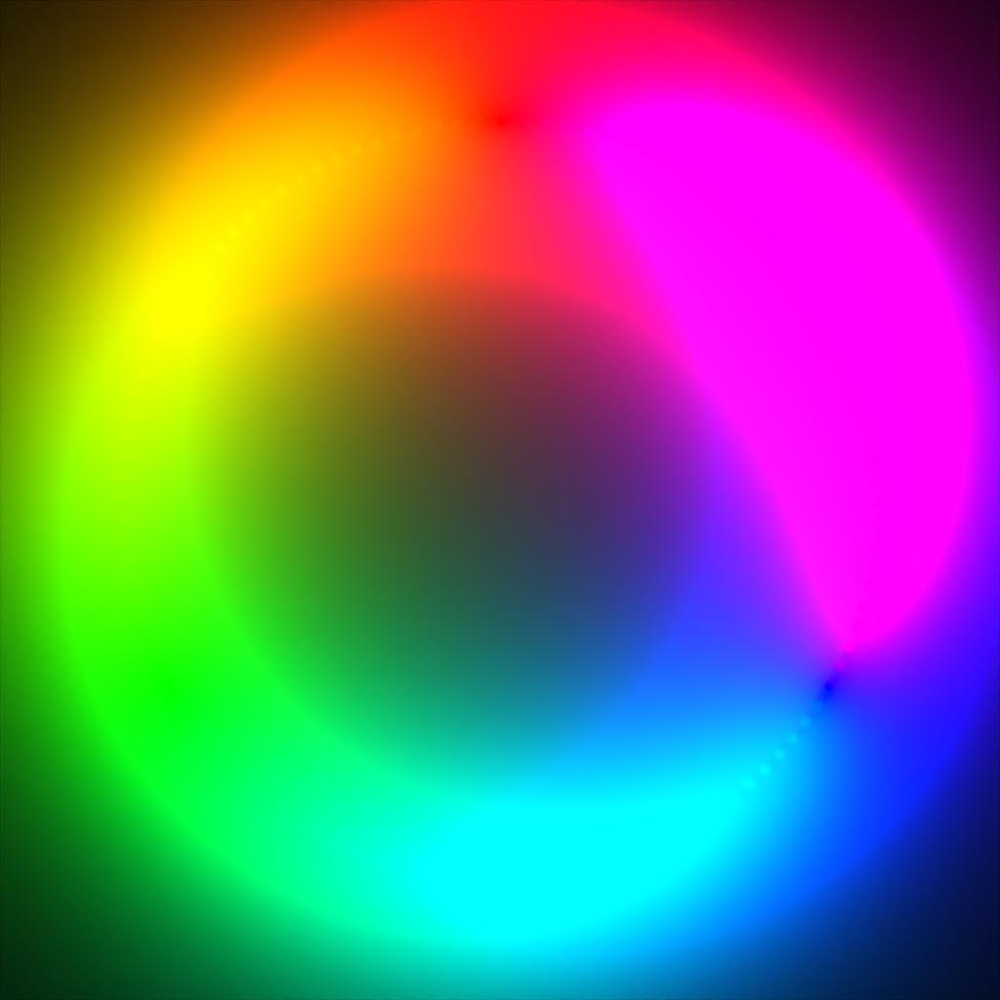
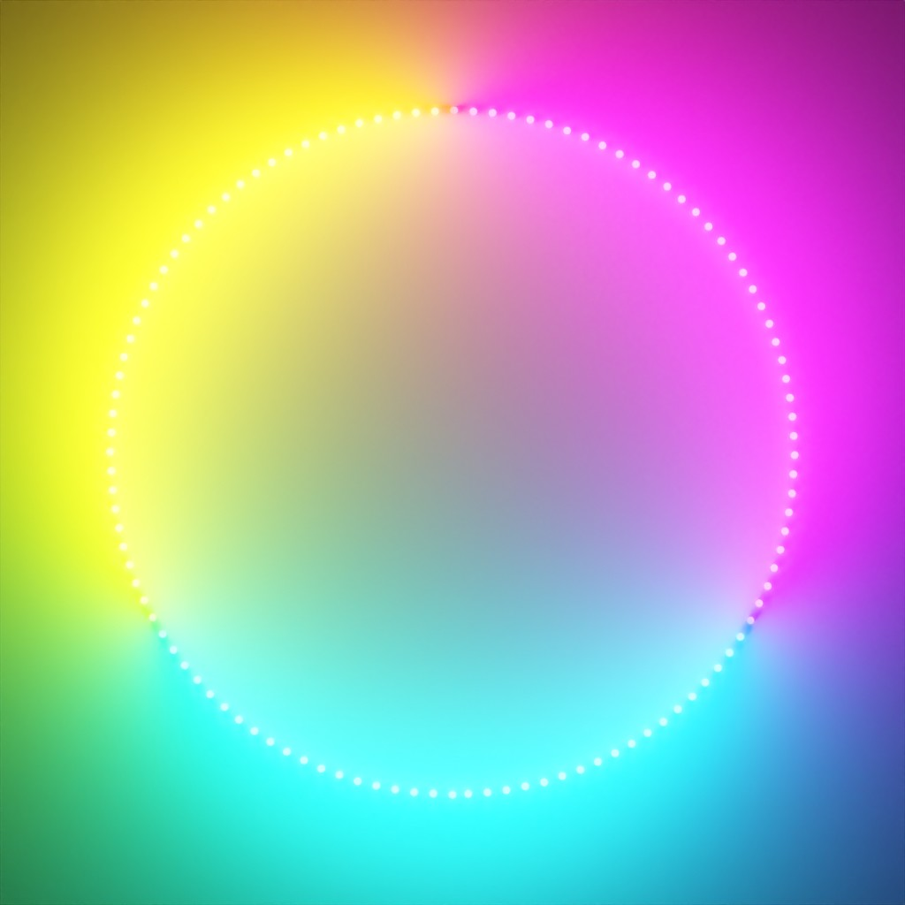
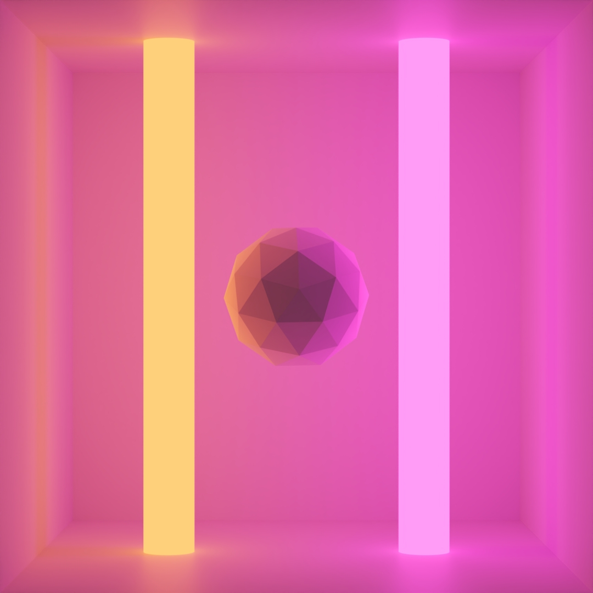
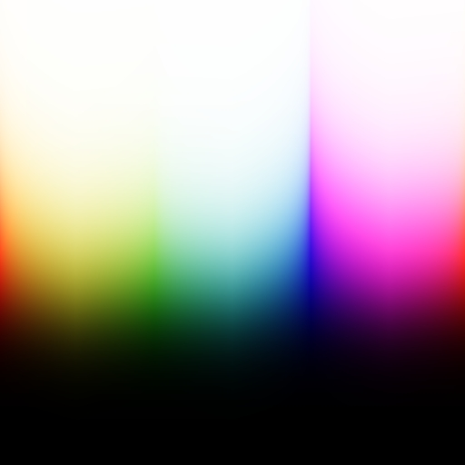
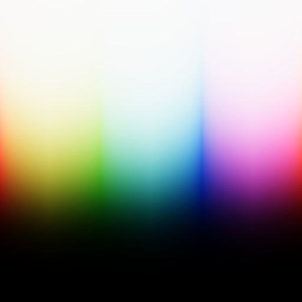
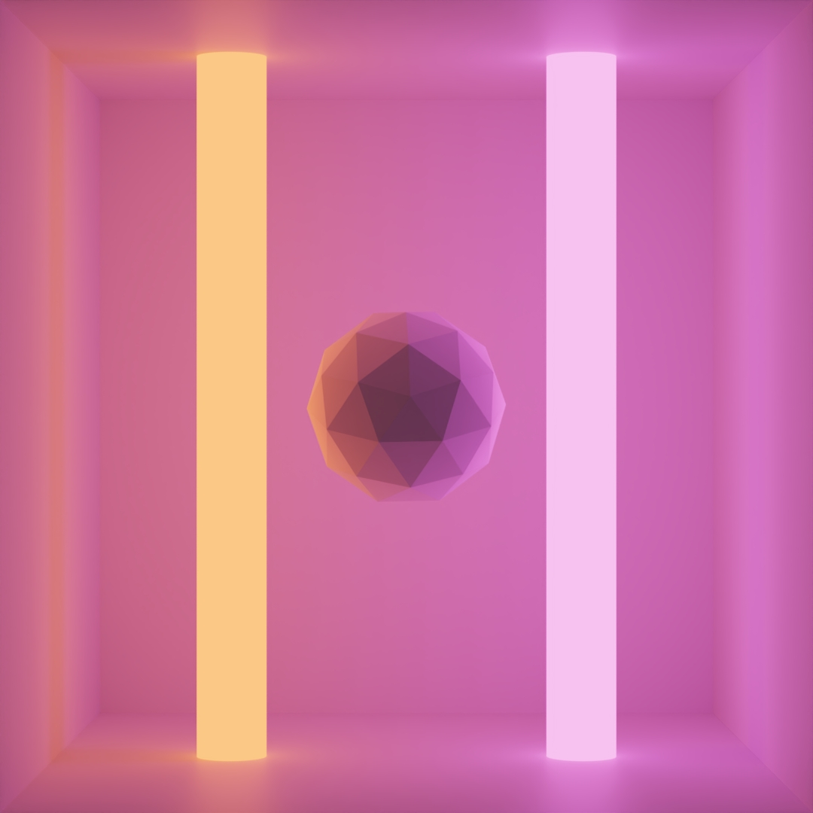
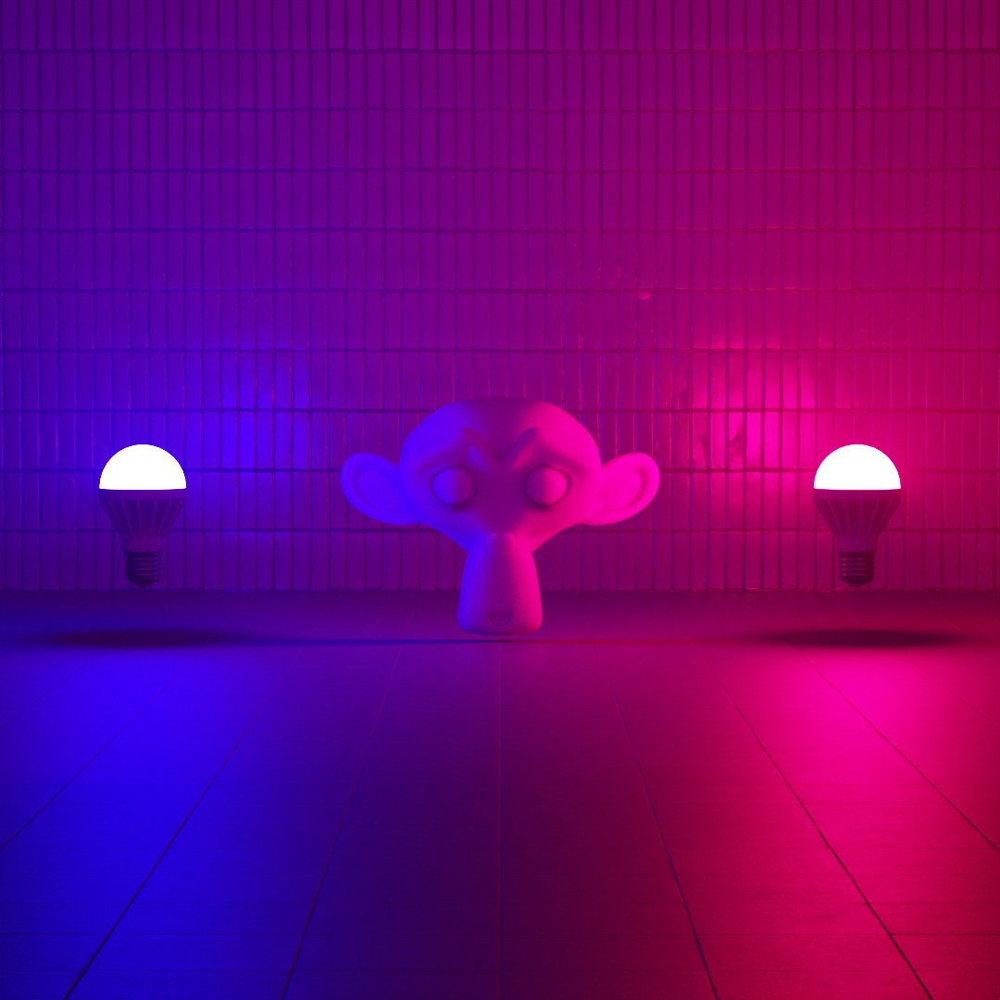
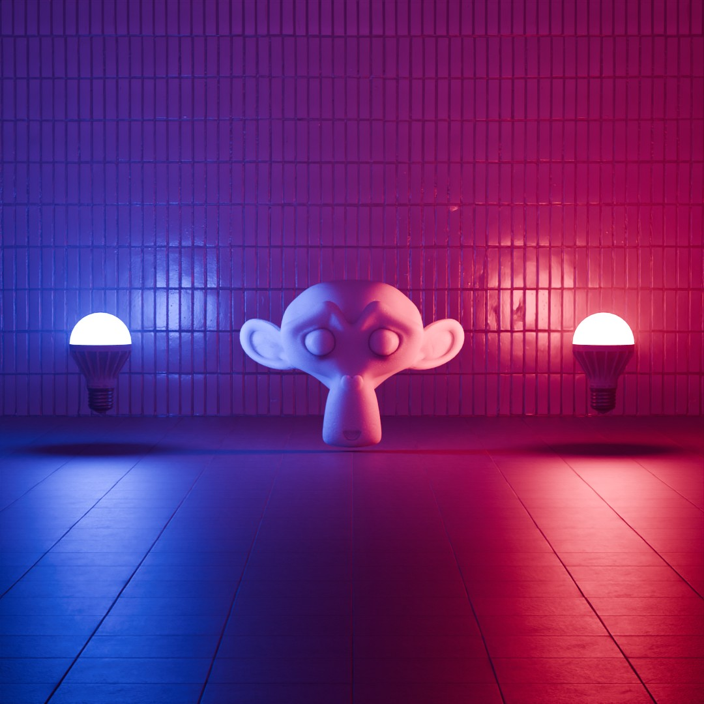

<header style="width: 100%; text-align: center; align-content: center; align-self: center; margin-bottom: 75px; color: #fff; text-decoration: none;">
        <nav>
            <a style="color: #fff; text-decoration: none; margin-right: 20px;" href="https://thecodecofficial.github.io/Blog/">Home</a>
            <a style="color: #fff; text-decoration: none; margin-right: 20px;" href="https://thecodecofficial.github.io/Blog/about.html">About</a>
        </nav>
    </header>
<div style="text-align:center"><h1>Reverse Engineering Blender's AgX Tonemapper</h1>
    <h6>
    	25. September 2024
    </h6>
</div>
<figure style="text-align: center">
  
</figure>
#### Motivation

With version 4, Blender came with a brand new set of color management options. Most notably, the AgX^1^ view transform was added as the default view transform. AgX is a tone mapper that compresses the high range of colors into a limited dynamic range to display them on a screen. It handles over-exposed areas much better than former approaches by producing responses to high intensities similar to real cameras.

I've been working on a simple raytracer recently. I thought I could implement AgX into my pipeline to get a nice cinematic look. Looking into Blender's code I saw that it was implemented via a LUT, a lookup table containing precomputed color values. This kind of bugged me as I couldn't figure out how to transform the raw RGB values from the raytracer to use in the LUT. Also, there must be some direct way to compute it, as all the values in the LUT had to have been computed somehow. After hours of research trying to figure out AgX's implementation, I came up empty-handed so I ultimately decided to create my own approximation for AgX. 

The main goal was to create a tone mapper that is similar to AgX and looks nice, everything else came after that. So I didn't care about the exact accuracy as long as it looked visually pleasing. Performance was also a low priority since I didn't intend to use it in a real-time context.

#### Tone Mapping

Standard RGB colors are usually defined in a range of $[0, 1]$ (or $0-255$ for integers). Many sources of color data such as renderers or even cameras often go outside this range and output color values that are much larger than one. This is called high dynamic range (HDR). To view colors outside of the default range on a regular screen they need to be remapped back to $[0, 1]$. The process of remapping HDR to the standard dynamic range (SDR) is called tone mapping and a function $T:[0,\infin[\rightarrow[0,1]$ is called a tone mapping operator.

There are various tone mapping operators out there. In this post we'll only focus on global tone mapping operators, i.e. each pixel is mapped to another value independently of other pixels. Let's explore some existing tone mappers. We'll compare them by looking at a simple scene containing a ring of emissive cylinders on a white plane. As a baseline, we'll set the intensity of the emission to one, so the final render should roughly be in SDR already.

<figure style="text-align: center">
  
  <figcaption style="text-align: center">Scene (SDR)</figcaption>
</figure>
Now to see the effects of the tone mapping operators, we'll increase the intensity of each cylinder to 100.

- No tone mapping or **clamping** is the most trivial approach. We simply constrain all values to the range $[0, 1]$ and call it a day. This effectively discards all HDR information and thus looks quite bad in general. We can see that colors are blown out in bright areas and have a very abrupt falloff toward darker areas. The variety of colors also seems to be reduced: We can only make out around six shades. This is called the six colors problem or the Notorious Six. Additionally, clamping can create banding artifacts, as each color channel is clamped separately.

   <figure style="text-align: center">
     
     <figcaption style="text-align: center">Clamping/No Tone Mapping</figcaption>
   </figure>

- **Reinhard**^2^ tone mapping is defined as $T_\text{Reinhard}(l)=\frac{l}{l+1}$. This ensures that every value is mapped to the range $[0, 1]$. Note that $T_\text{Reinhard}$ is applied to the luminance $l$ of a pixel, and the RGB values are then changed based on the new luminance.

   <figure style="text-align: center">
     
     <figcaption style="text-align: center">(Simple) Reinhard Tone Mapping</figcaption>
   </figure>

- **Filmic** tone mapping is a collective term for a bunch of tone mapping operators that try to emulate the look of real film cameras. Taking the one from Blender as an example, we can see that this also greatly suffers from the six colors problem.

   <figure style="text-align: center">
     
     <figcaption style="text-align: center">Filmic Tone Mapping (Blender)</figcaption>
   </figure>

- **ACES**^3^ stands for Academy Color Encoding System and is the industry standard for color management in movie and TV show production. It comes with its own tone mapper to display colors on SDR devices. ACES generally looks quite nice and is widely available in various renderers and game engines (e.g. Unreal Engine uses ACES as the default).

  <figure style="text-align: center">
    
    <figcaption style="text-align: center">ACES Tone Mapping (Hill<sup>4</sup>)</figcaption>
  </figure>
  - **AgX** (from silver halide^5^, a chemical used in photographic film) is currently the standard tonemapper in Blender. It was designed for better color management, replacing Blender's Filmic tone mapping. Bright areas are handled especially well and AgX doesn't suffer from the six colors problem. The resulting image might have some hue shifts and low contrast, but the latter can be fixed easily by further image processing.
  
    <figure style="text-align: center">
      
      <figcaption style="text-align: center">AgX Tone Mapping (Blender)</figcaption>
    </figure>

#### Looking at Existing Approximations

One popular implementation of ACES tone mapping is an approximation by Stephen Hill. First, it transforms the raw input color into a color space defined by ACES. The values are then transformed in this new space according to a sigmoid-like function, followed by a transformation back to RGB. The sigmoid-like function (`RRTandODTFit` in the code snippet) is an approximative fit of the real RRT and ODT functions defined by ACES (the exact meaning of these functions is not important for this post).

````c++
static const float3x3 ACESInputMat =
{
    {0.59719, 0.35458, 0.04823},
    {0.07600, 0.90834, 0.01566},
    {0.02840, 0.13383, 0.83777}
};

static const float3x3 ACESOutputMat =
{
    { 1.60475, -0.53108, -0.07367},
    {-0.10208,  1.10813, -0.00605},
    {-0.00327, -0.07276,  1.07602}
};

float3 RRTAndODTFit(float3 v)
{
    float3 a = v * (v + 0.0245786f) - 0.000090537f;
    float3 b = v * (0.983729f * v + 0.4329510f) + 0.238081f;
    return a / b;
}

float3 ACESFitted(float3 color)
{
    color = mul(ACESInputMat, color);
    color = RRTAndODTFit(color);
    color = mul(ACESOutputMat, color);

    return saturate(color); // Clamp to [0, 1]
}
````
<p class="code-caption">Hill ACES Tone Mapping (Simplified)</p>

In mathematical terms, we have the transformation matrices $T_{\text{ACES}_\text{in}}, T_{\text{ACES}_\text{out}}$, and a function $f_\text{RRT\_ODT}(c)$. The tone mapping operator is then defined as
$$
c_\text{out} =\text{clamp}(T_{\text{ACES}_\text{out}}\cdot f_\text{RRT\_ODT} (T_{\text{ACES}_\text{in}}\cdot c_\text{in}))
$$
where $c_\text{in}, c_\text{out}$ are the input and output colors respectively. The $\text{clamp}$ function constrains the output to $[0, 1]$ because some values might still be outside this range.

#### Approximating AgX

I thought that this approach for the ACES tone mapping could be used for other tone mapping operators by replacing $f_\text{RRT\_ODT}$ with another function $f$. This essentially boils down to a tone mapping $f$ inside the ACES color space. Through experimentation, I found that a function similar to the Reinhard operator yields similar-looking results to AgX when inserted into the equation (and interpreted as gamma corrected, more on that later).
$$
c_\text{out} =\text{clamp}(T_{\text{ACES}_\text{out}}\cdot f (T_{\text{ACES}_\text{in}}\cdot c_\text{in}))\\
f(c):=\frac{c}{c+0.2}
$$
Let's look at a simple scene for comparison:

<div style="display: flex; justify-content: center; align-items: center; flex-wrap: wrap; gap: 20px;">
  <figure style="flex: 1; text-align: center; margin: 10px; max-width: 45%;">
    
    <figcaption style="text-align: center">Clamped</figcaption>
  </figure>
  <figure style="flex: 1; text-align: center; margin: 10px; max-width: 45%;">
    
    <figcaption style="text-align: center">ACES</figcaption>
  </figure>
</div>

<div style="display: flex; justify-content: center; align-items: center; flex-wrap: wrap; gap: 20px;">
  <figure style="flex: 1; text-align: center; margin: 10px; max-width: 45%;">
    
    <figcaption style="text-align: center">Simple AgX Approximation</figcaption>
  </figure>
  <figure style="flex: 1; text-align: center; margin: 10px; max-width: 45%;">
    
    <figcaption style="text-align: center">AgX</figcaption>
  </figure>
</div>

Our simple AgX approximation is overall less saturated than ACES, giving a similar look to AgX. However, the exact saturation and intensity values are still a bit off. Also, there are some significant hue-shifts in the blues/purples, as can be seen in the following color spectrum comparison:

<div style="display: flex; justify-content: center; align-items: center; flex-wrap: wrap; gap: 20px;">
  <figure style="flex: 1; text-align: center; margin: 10px; max-width: 45%;">
    
    <figcaption style="text-align: center">Simple AgX Approximation</figcaption>
  </figure>
  <figure style="flex: 1; text-align: center; margin: 10px; max-width: 45%;">
    
    <figcaption style="text-align: center">AgX</figcaption>
  </figure>
</div>

It felt like I was getting closer to achieving the AgX look, so it was time to formulate this as an optimization problem. Let's modify $f$ to be more general: $f_{\alpha,\beta}(c)=\alpha\cdot\frac{c}{c+\beta}$. Additionally, let's introduce another transformation matrix $T_\text{shift}$ after $T_{\text{ACES}_\text{in}}$, to account for some interaction between the color channels (because $f_{\alpha,\beta}$ is applied to each channel separately and we might need to rotate the space first to fix the hue-shifts). So our final formula is
$$
c_\text{out} =\text{clamp}(T_{\text{ACES}_\text{out}}\cdot f_{\alpha,\beta} (T_\text{shift}\cdot T_{\text{ACES}_\text{in}}\cdot c_\text{in}))
$$
As a cost function, we can use a simple L2-norm. The optimization can then be formulated as follows:
$$
\tilde\alpha,\tilde\beta,\tilde{T}_\text{shift}=\underset{\alpha,\beta,T_\text{shift}}{\arg\min}\space ||c_\text{out}-c_\text{AgX}||_2\\
$$
Where $c_\text{AgX}$ is the true AgX tone mapped color corresponding to $c_\text{in}$.

#### Obtaining Data and Fitting

Next, I needed some data points to fit the model. For this I simply created a few scenes with a good variety of colors and intensities in Blender, rendered them, and exported them as both raw and AgX tone mapped. To ensure that the data is as accurate as possible, I exported everything in the OpenEXR format. This supports a high color depth, gets rid of any unwanted compression artifacts and we don't have to worry about any gamma correction related stuff (turns out we DO have to worry about that, more on that in the next section).

There might be a neat way to solve the optimization and get the best result. However, a close solution is good enough and I really couldn't be bothered so I decided to use SciPy to solve it. Using BFGS yields the following parameters (rounded to 5 digits after the decimal):
$$
\alpha=0.98107,\beta=0.73904,
T_\text{shift}=
\begin{bmatrix}
3.28857&-0.20076&0.09608\\
0.14416&2.8911&0.39909\\
0.14185&-0.20982&3.60765\\
\end{bmatrix}
$$
This completes our approximation of AgX tone mapping.

Let's look at the color spectrum again:

<div style="display: flex; justify-content: center; align-items: center; flex-wrap: wrap; gap: 20px;">
  <figure style="flex: 1; text-align: center; margin: 10px; max-width: 45%;">
    
    <figcaption style="text-align: center">AgX Approximation</figcaption>
  </figure>
  <figure style="flex: 1; text-align: center; margin: 10px; max-width: 45%;">
    
    <figcaption style="text-align: center">AgX</figcaption>
  </figure>
</div>
We can see that the hue-shifts in the blues/purples have been resolved, and overall the two images look quite similar to the eye.

#### A Quick Note on Gamma Correction

As it turns out, if you export an EXR with a tone map override in Blender, the result is going to be gamma corrected. This caused my dataset to be linear (input samples) and gamma corrected (output samples) at the same time. This is a bit cursed, as normally the transformation $T_{\text{ACES}_\text{out}}$ would get you back to a color in linear space. I realized this way too late, but since the fit is quite good, I’ve decided to leave it as is—if it works, it works. To get it to be in linear color space again, I just slapped a good old $x^{2.2}$ at the end (this gamma decodes it). 

#### Implementation

We can combine the matrices $T_{\text{ACES}_\text{in}}$ and $T_\text{shift}$ into one to save a (somewhat) expensive matrix multiplication. I decided to call my approximation AgES, a combination of AgX and ACES (I know this doesn't really make sense but it sounds cool).

```python
def AgES_tonemap(x):
    AgES_input_mat = np.array(
        [
            [1.95137, 0.99656, 0.23596],
            [0.31715, 2.73063, 0.38657],
            [0.17122, 0.34252, 3.02594],
        ]
    )
    AgES_output_mat = np.array(
        [
            [1.60475, -0.53108, -0.07367],
            [-0.10208, 1.10813, -0.00605],
            [-0.00327, -0.07276, 1.07602],
        ]
    )

    x = np.dot(x, AgES_input_mat.T)
    x = 0.98107 * x / (x + 0.73904)
    x = np.dot(x, AgES_output_mat.T)
    x = np.clip(x, 0, 1)
    return x ** 2.2
```

 <p class="code-caption">Python Implementation of AgES Tone Mapping</p>

#### Results

Let's look at the scene from before again, now with our AgES tone mapper:

<div style="display: flex; justify-content: center; align-items: center; flex-wrap: wrap; gap: 20px;">
  <figure style="flex: 1; text-align: center; margin: 10px; max-width: 45%;">
    
    <figcaption style="text-align: center">AgX</figcaption>
  </figure>
  <figure style="flex: 1; text-align: center; margin: 10px; max-width: 45%;">
    
    <figcaption style="text-align: center">AgES</figcaption>
  </figure>
</div>

We can still make out some saturation differences. However, I'd say it's fairly close and most importantly it looks good. Let's look at a more detailed scene:

<div style="display: flex; justify-content: center; align-items: center; flex-wrap: wrap; gap: 20px;">
  <figure style="flex: 1; text-align: center; max-width: 45%;">
    
    <figcaption style="text-align: center">Clamped</figcaption>
  </figure>
  <figure style="flex: 1; text-align: center; max-width: 45%;">
    
    <figcaption style="text-align: center">Filmic (Blender)</figcaption>
  </figure>
    <figure style="flex: 1; text-align: center; max-width: 45%;">
    
    <figcaption style="text-align: center">ACES (Hill)</figcaption>
  </figure>
</div>

<div style="display: flex; justify-content: center; align-items: center; flex-wrap: wrap; gap: 20px;">
  <figure style="flex: 1; text-align: center; max-width: 50%;">
    
    <figcaption style="text-align: center">AgES</figcaption>
  </figure>
  <figure style="flex: 1; text-align: center; max-width: 50%;">
    
    <figcaption style="text-align: center">AgX</figcaption>
  </figure>
</div>

A few things to note here:

- Clamping looks horrible. This is because the blue light bulb emits a pure blue color, so no matter how bright it is, the red and green channels are always going to be zero. We also lose a lot of information in the reflection on the ground.
- Blender's filmic tone mapping handles the bright bulbs pretty well, but we still have some loss of detail on the monkey and the ground.
- ACES looks good but is very saturated. The blue highlights noticeably tend towards purple.
- AgX and AgES look very nice with the latter being a bit darker overall. There are some subtle hue-shifts when comparing the two.

<div style="display: flex; justify-content: center; align-items: center; flex-wrap: wrap; gap: 20px;">
  <figure style="flex: 1; text-align: center; margin: 10px; max-width: 45%;">
    
    <figcaption style="text-align: center">AgES</figcaption>
  </figure>
  <figure style="flex: 1; text-align: center; margin: 10px; max-width: 45%;">
    
    <figcaption style="text-align: center">AgX</figcaption>
  </figure>
</div>

#### References/Acknowledgements

1. https://github.com/EaryChow/AgX
2. https://64.github.io/tonemapping/
3. https://www.oscars.org/science-technology/sci-tech-projects/aces
4. https://github.com/TheRealMJP/BakingLab/blob/master/BakingLab/ACES.hlsl
5. https://en.wikipedia.org/wiki/Silver_halide

#### Contact

Questions and feedback are always welcome!

<div style="text-align: center">
    <a href="https://github.com/TheCodecOfficial"></a>
    <a href="mailto:trutsch@student.ethz.ch"></a>
    <!--
    <textarea id="textbox" style="display: none">TheCodec#2261</textarea>
</div>
<div style="text-align: center; display: none" id="copyInfo"><p>Copied Discord Username to Clipboard</p>-->
</div>
<webring-banner theme="dark" style="display: flex; justify-content: center; align-items: center;">
    <p>Member of the <a href="https://polyring.ch">Polyring</a> webring</p>
</webring-banner>
<script async src="https://polyring.ch/embed.js" charset="utf-8"></script>

