<header style="width: 100%; text-align: center; align-content: center; align-self: center; margin-bottom: 75px; color: #fff; text-decoration: none;">
        <nav>
            <a style="color: #fff; text-decoration: none; margin-right: 20px;" href="https://thecodecofficial.github.io/Blog/">Home</a>
            <a style="color: #fff; text-decoration: none; margin-right: 20px;" href="https://thecodecofficial.github.io/Blog/about.html">About</a>
        </nav>
    </header>

<h1>Designing Beautiful Worlds with Procedural Texture Generation</h1>
    <h6>
    	29. January 2023
    </h6>

<figure style="text-align: center">
  
</figure>

*If you don't wanna read the post you can check out an interactive playground [here](https://thecodec.itch.io/procedural-planet-generation-playground)*

#### Motivation

I wanted to experiment with rendering planets and stars to make cool pictures or to use them in a game. Creating visually appealing 3D renders of space can be difficult though, as there aren't many good textures around. [NASA](https://nasa3d.arc.nasa.gov/images) has released some color maps of real planets and moons, but many of them have very visible artifacts and other crucial maps such as normal maps and specular maps simply don't exist. That's why I decided to go for a procedural approach, meaning that instead of using premade textures, there is a program that calculates the textures dynamically. My goal was to render everything in real time and to make it look appealing (not necessarily realistic).

#### Starting with Basic Noise

The foundation of any procedural texture is randomness - in the form of a texture it is usually called noise. Let's try to create some noise by choosing a random grayscale value for each pixel in an image.

<figure style="text-align: center">
  
  <figcaption style="text-align: center">Random Noise</figcaption>
</figure>

This looks pretty bad.. It is not natural at all. Let's try something else.

<figure style="text-align: center">
  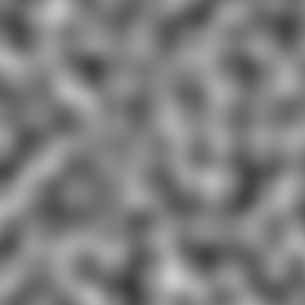
  <figcaption style="text-align: center">Perlin Noise</figcaption>
</figure>
[Perlin Noise](https://en.wikipedia.org/wiki/Perlin_noise) is a widely-used noise function. It creates smooth looking noise, which is way better suited for many applications. However, in nature we won't find anything this uniformly smooth... let's keep looking.

<figure style="text-align: center">
  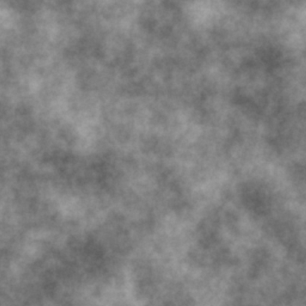
  <figcaption style="text-align: center">Fractal Perlin Noise</figcaption>
</figure>
The idea of fractal noise is to combine many noise layers with increasing frequency and decreasing amplitude. The low frequency noise defines the overall look while the high frequency noise adds a lot of detail. It has the best of both worlds - randomness and structure. We normalize all these noise functions to some range (usually $[0, 1]$ or $[-1, 1]$) to make it easier to work with.

#### Adding More Details: UV Noise

Another key concept is to displace the coordinates before plugging them into the noise function. Coordinates are stored in a UV map, where each pixel stores that pixel's coordinates (using two color channels). Displacing the coordinates is as easy as applying noise to the UV map. Generally we add some noise map with very low amplitude to the UV map, which results in small, local distortions. These distortions get amplified when plugged into a noise function, resulting in very fine details.

<figure style="text-align: center">
  
  <figcaption style="text-align: center">Regular 2D UV-Map (left), Distorted 2D UV-Map (right)</figcaption>
</figure>

<figure style="text-align: center">
  
  <figcaption style="text-align: center">The  Resulting Noise from these UV-Maps (Fractal Perlin)</figcaption>
</figure>

We can also apply any mathematical function to the noise, for example `abs()` to create sharp ridges. With these simple tools we can easily create a variety of complex noise functions.

<figure style="text-align: center">
  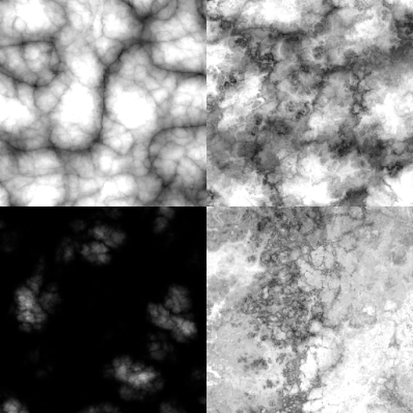
  <figcaption style="text-align: center">Different Noise Maps</figcaption>
</figure>

If we use 3D noise functions we don't need to project a 2D texture onto a sphere which could lead to projection-artifacts. Plugging the (xyz) coordinates of each point of a sphere into our function, and coloring the pixels according to the output (gray), results in the following image (with some additional lighting & shading):

<figure style="text-align: center">
  
  <figcaption style="text-align: center">Our Noise Function Applied to the Surface of a Sphere</figcaption>
</figure>
For animations we sometimes even need a 4D noise function!

#### Colors

Our results so far look pretty nice, but it's all gray. To add color we want to define some process that maps each grayscale value to some color value. One easy way to do that is through a gradient.

<figure style="text-align: center">
  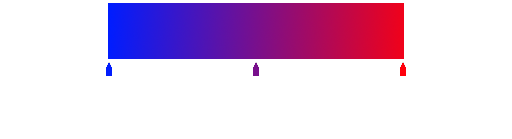
  <figcaption style="text-align: center">A Color Gradient</figcaption>
</figure>

We define the gradient through two or more keys in (usually in the range $[0,1]$). The above gradient has two key-value-pairs: $(0,\text{blue})$ and $(1,\text{red})$. All values between two keys are linearly interpolated, which in this case results in purple at position $(0.5)$. For a predefined gradient we just need to look up the keys and interpolate to get a color for a given value. For this project I limited the number of keys to four.

Plugging our previous noise into a gradient results in a colored planet:

<figure style="text-align: center">
  
  <figcaption style="text-align: center">Our Planet after Applying a Color Gradient to the Noise</figcaption>
</figure>

#### Adding more Features: Craters, Oceans & Icy Poles

We have some nice looking rocky planets, but we might want to have some more features than just colored noise.

- **Craters:** Many planets and moons have visible craters. To simulate a crater-landscape, let's look at Voronoi noise.

  <figure style="text-align: center">
    
    <figcaption style="text-align: center">Voronoi Noise</figcaption>
  </figure>

  Voronoi noise is generated by placing random points in space and, for each pixel, calculating the distance to the closest point. We can use the same tricks as before to distort, modify and remap this noise to get something more natural.

  <figure style="text-align: center">
    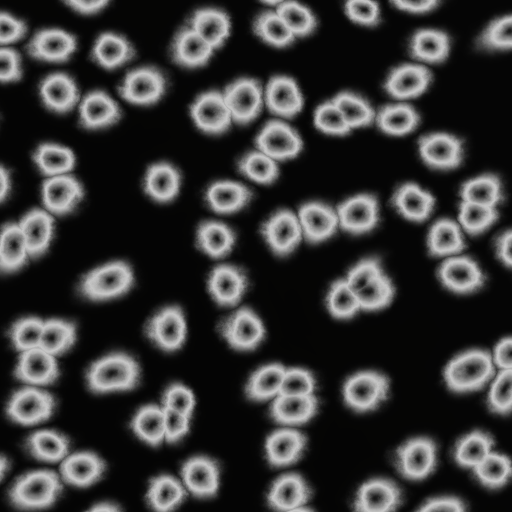
    <figcaption style="text-align: center">Modified Voronoi Noise</figcaption>
  </figure>

  With this type of noise we don't necessarily need to modify the existing color of the planet, but rather the geometry of the sphere so it actually looks like something impacted the surface. We can simulate this pretty well by using the modified Voronoi noise as a bump map. This adds bumps to the surface where brighter values correspond to higher bumps. Often we unrealistically exaggerate the strength of these bumps to get a more cinematic look.

  <figure style="text-align: center">
    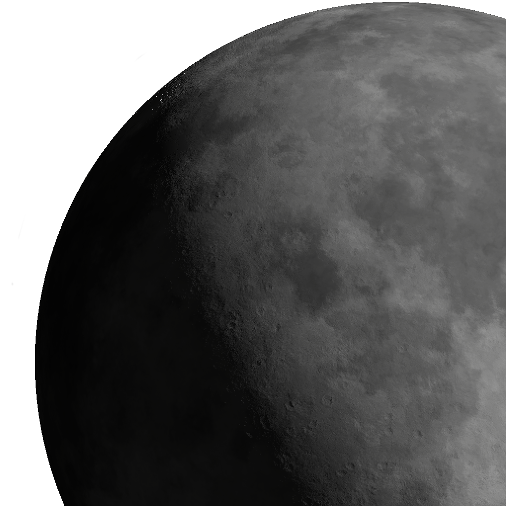
    <figcaption style="text-align: center">Visible Impact Craters on the Penumbra</figcaption>
  </figure>

- **Oceans: **We can define some waterlevel and treat the noise values as height values. Values below the waterlevel should be water, i.e. have uniform height and some predefined color. Additionally, we can make the water surface more shiny. The crater map from before can also be used to modify the height map to make it look like the craters have been filled with water.

  <figure style="text-align: center">
    
    <figcaption style="text-align: center">Different Waterlevels</figcaption>
  </figure>

  <figure style="text-align: center">
    
    <figcaption style="text-align: center">Water-Filled Craters </figcaption>
  </figure>

- **Ice Caps:** Planets often come with large areas of ice at the poles. We can imitate this by coloring points with a Y-coordinate above some threshold white and slightly shiny. We can do the same with a negative threshold for the other pole. Previous bump maps should be overwritten, as ice usually forms later than impact craters. And as always, we apply a generous amount of noise to distort it and make it look more natural.

  <figure style="text-align: center">
    
    <figcaption style="text-align: center">North- and South Pole Ice Caps</figcaption>
  </figure>

#### Atmospheres

To really sell the effect and to put it all together we can add an atmosphere. Calculating  atmospheric scattering in real time is very expensive, so I opted for a simpler, cheaper approach. Basically, we have a semi-transparent hemisphere that always points in the direction of the light and gets less transparent on the edges to simulate thicker parts of the atmosphere. To achieve a more cinematic look we can even choose colors that wouldn't make any sense in an atmosphere (e.g. a golden atmosphere for mars). Again, the primary goal is to make it look good, not realistic.

Clouds can also be added easily by taking some swirly noise and making certain parts of it transparent.

<figure style="text-align: center">
  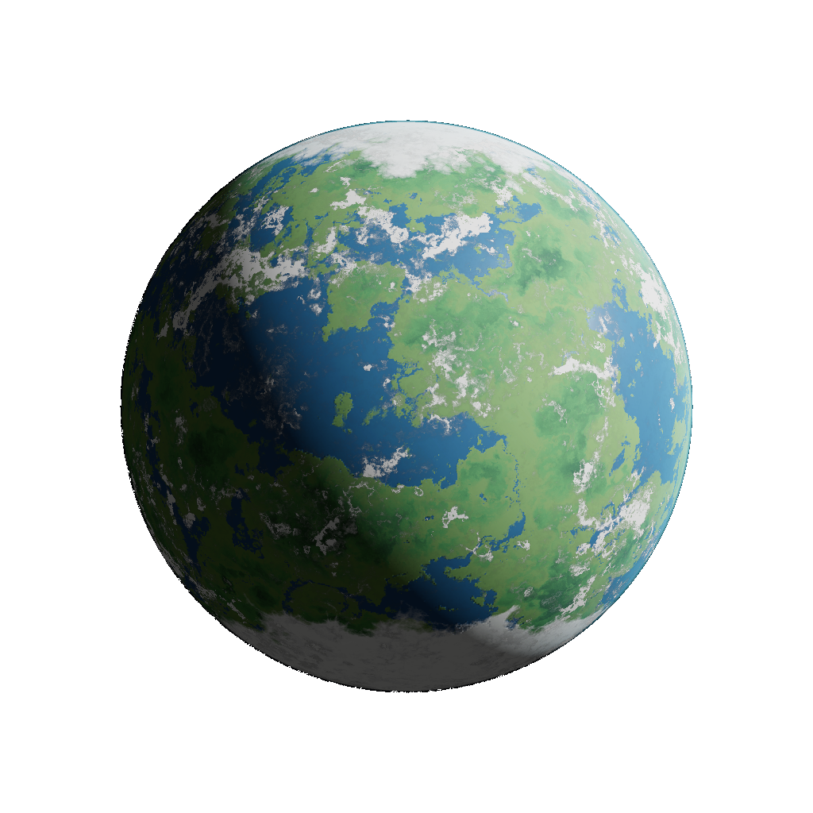
  <figcaption style="text-align: center">An Earth-Like Planet with Clouds and Atmospheric Scattering</figcaption>
</figure>

#### Gas Planets

We can create pretty nice looking rocky planets and moons, but what about gas planets? Our current setup isn't suitable for gas planets since most gas planets are uniform in color or have some very distinct horizontal bands. By plugging in some distorted UVs into a sine function we can create bands with turbulence.

<figure style="text-align: center">
  
  <figcaption style="text-align: center">Vertical Bands with "Turbulence"</figcaption>
</figure>

By layering a bunch of these bands with different frequencies, amplitudes and phases, we get a very detailed map resembling a gas planet. Just like before, we color it using a gradient.

<figure style="text-align: center">
  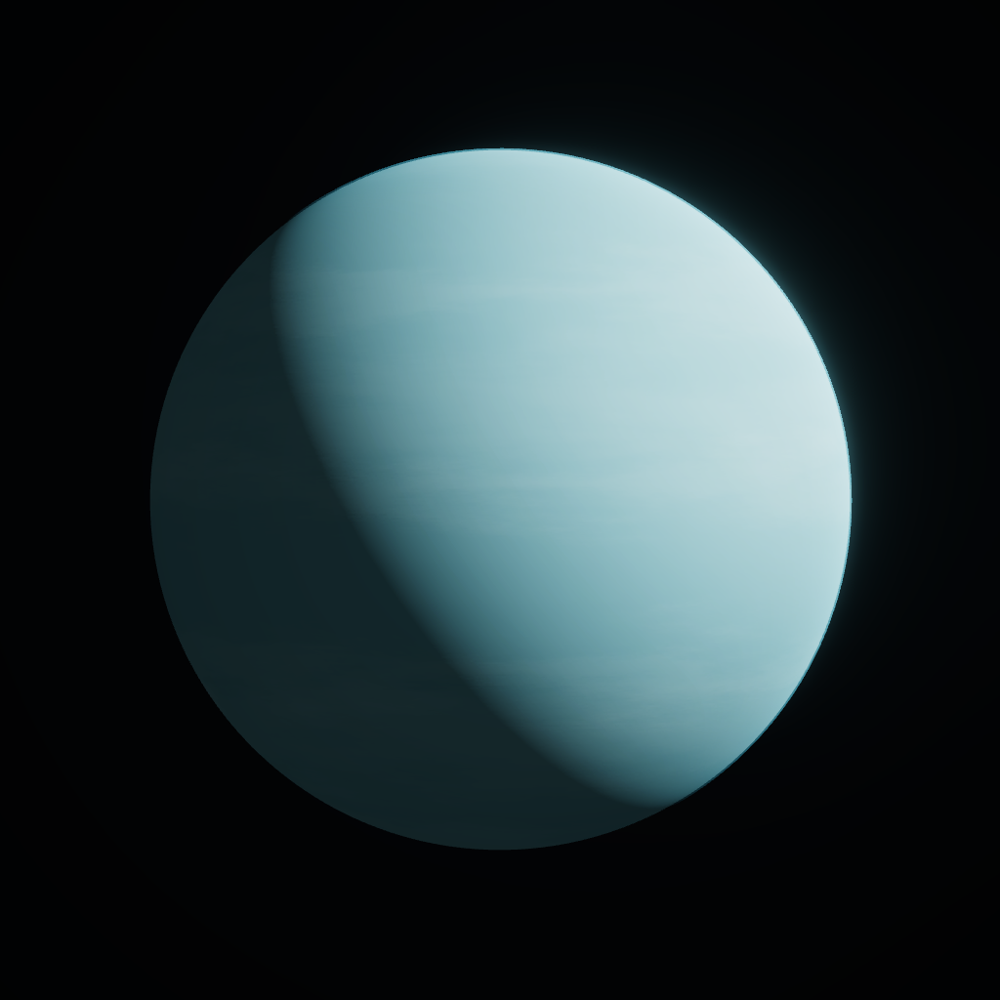
  <figcaption style="text-align: center">Uranus-Like Gas Planet</figcaption>
</figure>

<figure style="text-align: center">
  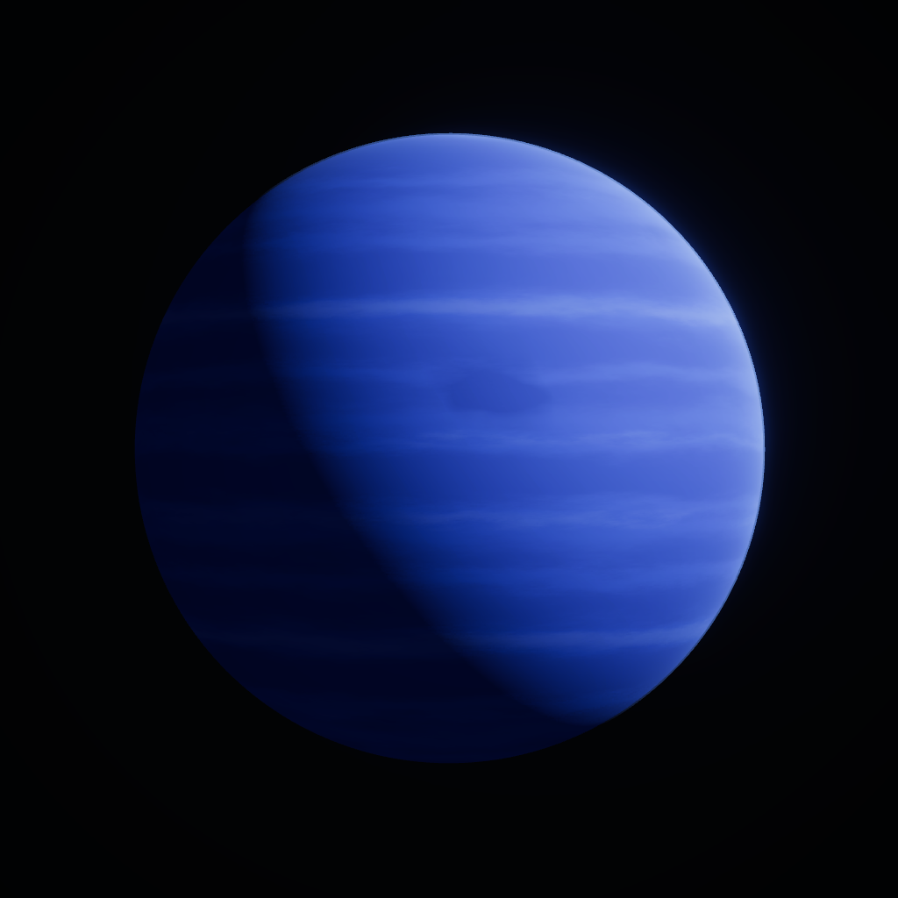
  <figcaption style="text-align: center">Neptune-Like Gas Planet</figcaption>
</figure>

The "storm" in Neptune was created using Voronoi noise.

#### Ring Systems

Somethings seems to be missing... ah yes, rings! By now you should know the deal: Take the UVs, distort them, plug them into some noise function and voilà, rings.

<figure style="text-align: center">
  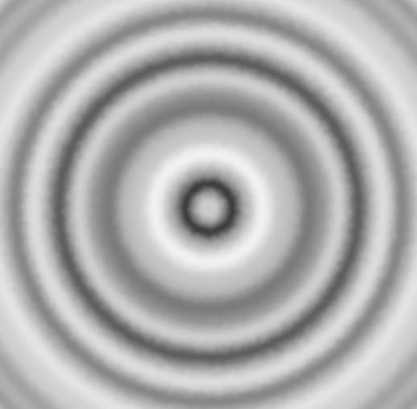
  <figcaption style="text-align: center">2D-Map of Rings</figcaption>
</figure>

We can use these values as the input for the alpha (transparency) channel.

<figure style="text-align: center">
  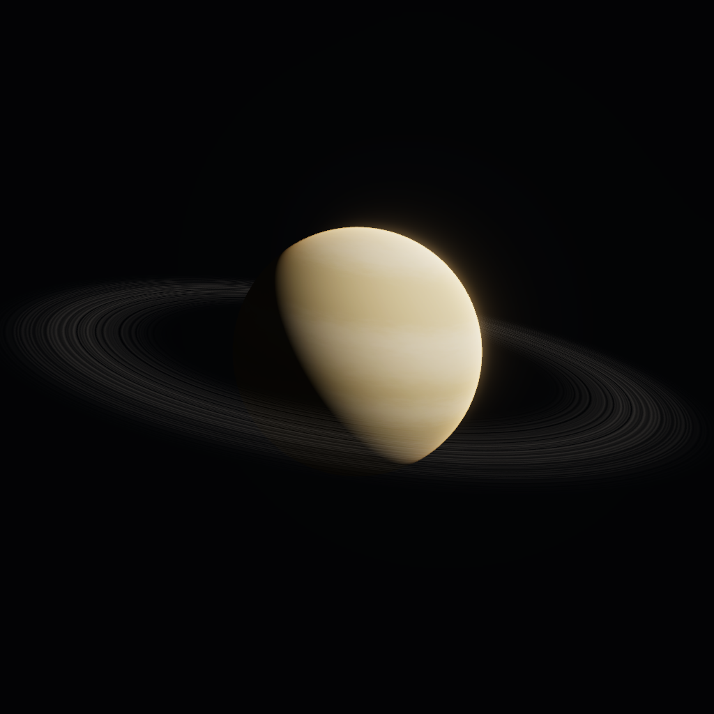
  <figcaption style="text-align: center">Applying the Ring-Map as Transparency to a Plane around a Planet</figcaption>
</figure>

#### Stars

Stars are arguably the easiest to recreate, since most stars are very uniform in texture and color. We can simply take some (distorted) Perlin noise and use it as an emission map for a sphere - that's it.

<figure style="text-align: center">
  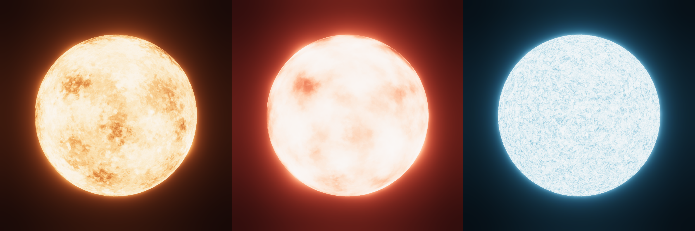
  <figcaption style="text-align: center">Stars with Different Scales of Noise and Color</figcaption>
</figure>

#### Adding a Skybox

Thinking back to Voronoi noise, we can also use it to create a starry sky. We can add thousands of bright, possibly colored, dots in the background to get a nice space background.

<figure style="text-align: center">
  
  <figcaption style="text-align: center">Voronoi-Based Star Skybox</figcaption>
</figure>
#### Finishing Touches: Post Processing

We can add a handful of post-processing image effects to spice up the final render and make it look more cinematic. The most notable effects are tonemapping/color grading, bloom and vignetting.

Here are some nice screenshots from various planets, moons and stars:

<figure style="text-align: center">
  
  <figcaption style="text-align: center">Various Planets, Moons and Stars</figcaption>
</figure>

#### Conclusion

We can create some pretty complex space renders with fairly easy methods. Rendering these scenes in real time is possible, but not very efficient since some planets use hundreds of layers of noise. For static renders this is not a problem, but if we were to use some of these in a game we would ideally bake the maps to image textures.

#### Contact

This is my first ever blog post - I'd appreciate any form of feedback!

    
    
    <!--
    <textarea id="textbox" style="display: none">TheCodec#2261</textarea>

Copied Discord Username to Clipboard
-->

<webring-banner theme="dark" style="display: flex; justify-content: center; align-items: center;">
    
Member of the <a href="https://polyring.ch">Polyring</a> webring

</webring-banner>

